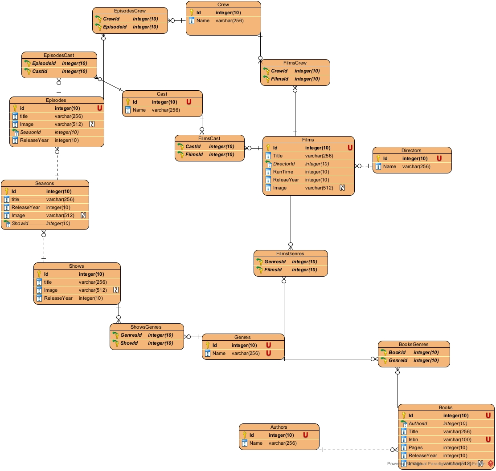

# Media Recommend


## SQL (Sqlite)



The following tables are created to store information about different types of media.

### Shared

#### Cast

```sql
CREATE TABLE "Cast" (
	"Id"	INTEGER NOT NULL UNIQUE,
	"Name"	TEXT NOT NULL,
	PRIMARY KEY("Id" AUTOINCREMENT)
);
```

#### Crew

```sql
CREATE TABLE "Crew" (
	"Id"	INTEGER NOT NULL UNIQUE,
	"Name"	TEXT NOT NULL,
	PRIMARY KEY("Id" AUTOINCREMENT)
);
```

#### Genres

```sql
CREATE TABLE "Genres" (
	"Id"	INTEGER NOT NULL UNIQUE,
	"Name"	TEXT NOT NULL,
	PRIMARY KEY("Id" AUTOINCREMENT)
);
```

### Films

#### Directors

```sql
CREATE TABLE "Directors" (
	"Id"	INTEGER NOT NULL UNIQUE,
	"Name"	TEXT NOT NULL,
	PRIMARY KEY("Id" AUTOINCREMENT)
);
```

### Books

#### Authors

```sql
CREATE TABLE "Authors" (
	"Id"	INTEGER NOT NULL UNIQUE,
	"Name"	TEXT NOT NULL,
	PRIMARY KEY("Id" AUTOINCREMENT)
);
```

#### Books

```sql
CREATE TABLE "Books" (
	"Id"	INTEGER NOT NULL UNIQUE,
	"AuthorId"	INTEGER NOT NULL,
    "Title"	TEXT NOT NULL,
    "Isbn"	TEXT NOT NULL UNIQUE,
    "Pages" INTEGER NOT NULL,
    "ReleaseYear" INTEGER NOT NULL,
    "Image" TEXT,
	PRIMARY KEY("Id" AUTOINCREMENT)
    FOREIGN KEY ("AuthorId") REFERENCES "Authors"("Id")  
);
```

#### BooksGenres

```sql
CREATE TABLE "BooksGenres" (
    "GenresId" INTEGER NOT NULL,
    "BookId" INTEGER NOT NULL,
    FOREIGN KEY ("GenresId") REFERENCES "Genres"("Id")
    FOREIGN KEY ("BookId") REFERENCES "Books"("Id")  
);
```

#### Films

```sql
CREATE TABLE "Films" (
    "Id" INTEGER NOT NULL UNIQUE,
    "Title" TEXT NOT NULL,
    "DirectorId" INTEGER NOT NULL,
    "RunTime" INTEGER NOT NULL,
    "ReleaseYear" INTEGER NOT NULL,
    "Image" TEXT,
    PRIMARY KEY("Id" AUTOINCREMENT) 
    FOREIGN KEY ("DirectorId") REFERENCES "Directors"("Id")
);
```

#### FilmsCast

```sql
CREATE TABLE "FilmsCast" (
    "CastId" INTEGER NOT NULL,
    "FilmsId" INTEGER NOT NULL,
    FOREIGN KEY ("CastId") REFERENCES "Cast"("Id")
    FOREIGN KEY ("FilmsId") REFERENCES "Films"("Id")  
);
```

#### FilmsCrew

```sql
CREATE TABLE "FilmsCrew" (
    "CrewId" INTEGER NOT NULL,
    "FilmsId" INTEGER NOT NULL,
    FOREIGN KEY ("CrewId") REFERENCES "Crew"("Id")
    FOREIGN KEY ("FilmsId") REFERENCES "Films"("Id")  
);
```

#### FilmsGenres

```sql
CREATE TABLE "FilmsGenres" (
    "GenresId" INTEGER NOT NULL,
    "FilmsId" INTEGER NOT NULL,
    FOREIGN KEY ("GenresId") REFERENCES "Genres"("Id")
    FOREIGN KEY ("FilmsId") REFERENCES "Films"("Id")  
);
```

### TV

#### 

```sql
CREATE TABLE "Shows" (
    "Id" INTEGER NOT NULL UNIQUE,
    "Title" TEXT NOT NULL,
    "Image" TEXT,
    "ReleaseYear" INTEGER NOT NULL,
    PRIMARY KEY("Id" AUTOINCREMENT)
);
```

#### ShowsGenres

```sql
CREATE TABLE "ShowsGenres" (
    "GenresId" INTEGER NOT NULL,
    "ShowId" INTEGER NOT NULL,
    FOREIGN KEY ("GenresId") REFERENCES "Genres"("Id")
    FOREIGN KEY ("ShowId") REFERENCES "Shows"("Id")  
);
```

#### Seasons

```sql
CREATE TABLE "Seasons" (
    "Id" INTEGER NOT NULL UNIQUE,
    "Title" TEXT NOT NULL,
    "ReleaseYear" INTEGER NOT NULL,
    "Image" TEXT,
    "ShowId" INTEGER NOT NULL,
    PRIMARY KEY("Id" AUTOINCREMENT)
    FOREIGN KEY ("ShowId") REFERENCES "Shows"("Id")
);
```

#### Episodes

```sql
CREATE TABLE "Episodes" (
    "Id" INTEGER NOT NULL UNIQUE,
    "Title" INTEGER NOT NULL,
    "Image" TEXT,
    "ReleaseYear" INTEGER NOT NULL,
    "SeasonId" INTEGER NOT NULL,
    PRIMARY KEY ("Id" AUTOINCREMENT)
    FOREIGN KEY ("SeasonId") REFERENCES "Seasons"("Id")
);
```

#### EpisodesCast

```sql
CREATE TABLE "EpisodesCast" (
    "CastId" INTEGER NOT NULL,
    "EpisodeId" INTEGER NOT NULL,
    FOREIGN KEY ("CastId") REFERENCES "Cast"("Id")
    FOREIGN KEY ("EpisodeId") REFERENCES "Episodes"("Id")  
);
```

#### EpisodesCrew

```sql
CREATE TABLE "EpisodesCrew" (
    "CrewId" INTEGER NOT NULL,
    "EpisodeId" INTEGER NOT NULL,
    FOREIGN KEY ("CrewId") REFERENCES "Crew"("Id")
    FOREIGN KEY ("EpisodeId") REFERENCES "Episodes"("Id")  
);
```